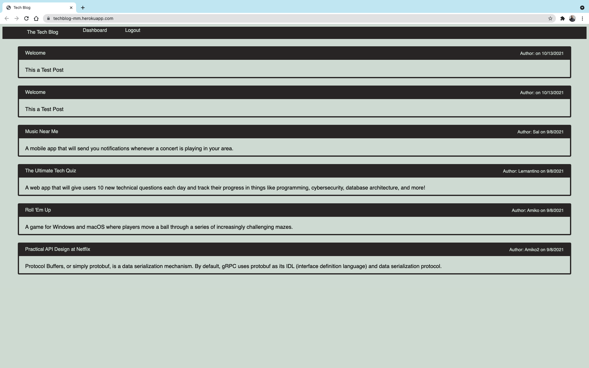
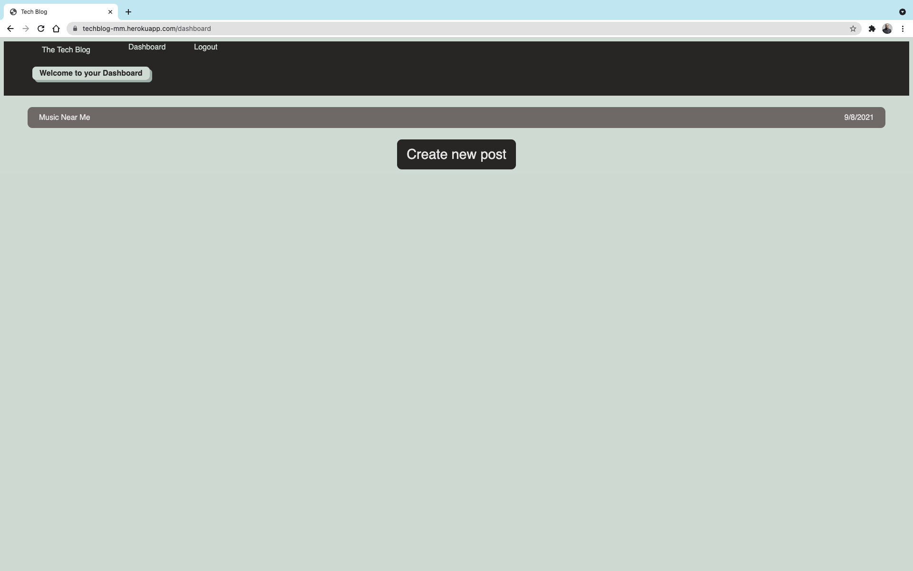
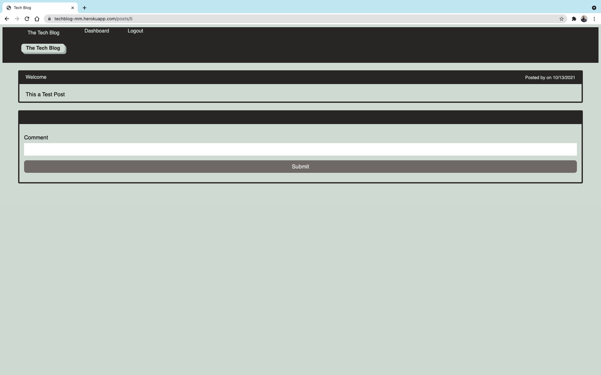

<div id="top"></div>

<!-- Badges -->
[](http://shields.io/)
[](http://shields.io/)
[](http://shields.io/)
[](http://shields.io/)
[](http://shields.io/)
[](http://shields.io/)
[](http://shields.io/)
[](http://shields.io/)

# Tech-Blog
CMS-style blog site similar to a Wordpress site, where developers can publish their blog posts and comment on other developers’ posts as well.
## Table of Contents
<!-- TABLE OF CONTENTS -->
<details>
  <summary><strong>Table of Contents</strong></summary>
  <ol>
    <li>
      <a href="#about-the-project">About The Project</a>
      <ul>
        <li><a href="#built-with">Built With</a></li>
      </ul>
    </li>
    <li><a href="#user-story">User Story</a></li>
    <li><a href="#link-to-live-demo">Link to Live Demo</a></li>
    <li><a href="#usage">Usage</a></li>
    <li><a href="#prerequisites">Prerequisites</a></li>
    <li><a href="#installation">Installation</a></li>
    <li><a href="#contributing">Contributing</a></li>
    <li><a href="#license">License</a></li>
    <li><a href="#contact">Contact</a></li>
    <li><a href="#acknowledgments">Acknowledgments</a></li>
  </ol>
</details>

## About The Project
Writing about tech can be just as important as making it. Developers spend plenty of time creating new applications and debugging existing codebases, but most developers also spend at least some of their time reading and writing about technical concepts, recent advancements, and new technologies.

<p align="center">
   
&nbsp; &nbsp; &nbsp; &nbsp;
  
&nbsp; &nbsp; &nbsp; &nbsp;
&nbsp; &nbsp; &nbsp; &nbsp;
  
</p>

## User Story

```md
AS A developer who writes about tech
I WANT a CMS-style blog site
SO THAT I can publish articles, blog posts, and my thoughts and opinions
```
### Link to Live Demo
[Tech Blog](https://techblog-mm.herokuapp.com/)

### Prerequisites

Please make sure that you have the latest node packages.
* npm
  ```sh
  npm install npm@latest -g
  ```

## Installation 
- Download it through Github
- Run npm i or (npm install), to make sure to download all the necessary files in the jason package.

## Usage 
This appllication follows the MVC paradigm in its architectural structure, using Handlebars.js as the templating language, Sequelize as the ORM, and the express-session npm package for authentication.

- Initiate the database with 'mysql -u root -p', then 'source db/schema.sql' to create the tables.
-  After installation Exit the mysql terminal and in the command line type `npm run seed` run Seed to seed the data to the Apllication DB
-  After installation and from bash or zsh, type `npm start` in the command line to start running the app.

### Built With

Node.js, Handlebard, Express, Sequelize and MySQL.
<p align="right">(<a href="#top">back to top</a>)</p>

## Contributing

Contributions are what make the open source community such an amazing place to learn, inspire, and create. Any contributions you make are **greatly appreciated**.

If you have a suggestion that would make this better, please fork the repo and create a pull request. You can also simply open an issue with the tag "enhancement".
Don't forget to give the project a star! Thanks again!

1. Fork the Project
2. Create your Feature Branch (`git checkout -b feature/AmazingFeature`)
3. Commit your Changes (`git commit -m 'Add some AmazingFeature'`)
4. Push to the Branch (`git push origin feature/AmazingFeature`)
5. Open a Pull Request


<!-- CONTACT -->
## Contact
[](http://shields.io/)

Mohamed Mesahel - mohamed.mesahel86@gmail.com

[](http://shields.io/)

https://github.com/MohamedMesahel

[![LinkedIn][linkedin-shield]][linkedin-url] 

<!-- LICENSE -->
## License

Distributed under the MIT License. 
<!-- ACKNOWLEDGMENTS -->
## Acknowledgments

List for some useful resources!
* [Node](https://node-app.com/)
* [MySQL](https://www.mysql.com/)
* [Handlebars](https://handlebarsjs.com/)


<p align="right">(<a href="#top">back to top</a>)</p>

<!-- MARKDOWN LINKS & IMAGES -->
<!-- https://www.markdownguide.org/basic-syntax/#reference-style-links -->
[linkedin-shield]: https://img.shields.io/badge/LinkedIn-0077B5?style=for-the-badge&logo=linkedin&logoColor=white
[linkedin-url]: https://www.linkedin.com/in/mohamed-mesahel-pmp-570a0423/